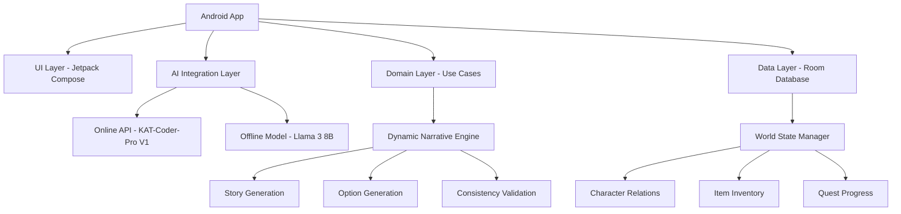

# 无限叙事游戏 - 《万象物语》

一个基于AI生成的个性化无限流文字冒险游戏，根据玩家的选择实时生成后续情节、角色对话和场景描述，确保故事永远不重样且逻辑自洽。

## 🎯 项目特色

### 🌟 核心创新
- **无限叙事**：AI实时生成故事，每个选择都创造独一无二的剧情
- **跨世界联动**：玩家的成长和收藏品可以在不同世界观间产生联动效应
- **智能状态管理**：维护"世界状态"确保故事连贯性
- **风格控制**：通过提示词保持特定的叙事风格

### 📚 三大世界观
基于 [deepseek_markdown.md](deepseek_markdown.md) 设计的三个充满张力的"叙事种子"：

1. **赛博蓬莱**：未来都市中的代码与灵气冲突
2. **法典迷城**：法律条文改写物理规则的奇幻世界  
3. **衰败王座**：无神世界中的信仰收集之旅

## 🏗️ 技术架构

### 核心技术栈
- **开发框架**：Android原生开发（Kotlin + Jetpack Compose）
- **AI集成**：混合模式（KAT-Coder-Pro V1 API + Llama 3 8B离线模型）
- **数据存储**：Room数据库（本地优先，预留云端扩展）
- **架构模式**：MVVM + Clean Architecture

### 系统架构图


## 📁 项目结构

```
app/src/main/java/com/infinite/narrative/
├── ai/                          # AI集成层
│   ├── model/                   # AI模型数据类
│   ├── AIClient.kt             # AI客户端接口
│   └── filter/                 # 内容过滤器
├── data/                       # 数据层
│   ├── model/                  # 数据实体
│   ├── dao/                    # 数据访问对象
│   └── seed/                   # 初始数据
├── engine/                     # 叙事引擎
├── ui/                         # 用户界面
│   ├── component/              # Compose组件
│   ├── viewmodel/              # ViewModel
│   └── MainActivity.kt        # 主Activity
└── MVPApplication.kt          # 应用主类
```

## 🎮 游戏系统

### 角色成长系统
- **三维核心属性**：
  - 洞察力：发现隐藏选项和剧情细节
  - 说服力：通过语言解决问题
  - 魄力：在冲突和物理对抗中的优势

### 概念性物品系统
突破传统物品限制，包含：
- "贵族的把柄"（概念性物品）
- "失传的旋律"（知识类物品）
- "未履行的契约"（概念性物品）
- "信仰之力"（精神类物品）

### 因果收藏馆
- 收录重要抉择、结局和独特物品
- 支持跨故事联动（如法典迷城的"法理悖论"可在赛博蓬莱使用）

## 🔧 开发配置

### 构建环境
```bash
# 安装依赖
./gradlew dependencies

# 构建项目
./gradlew assembleDebug

# 运行测试
./gradlew test
```

### 开发工具
- Android Studio Chipmunk+
- Kotlin 1.9.0+
- Gradle 8.6+

## 🚀 快速开始

1. **克隆项目**
   ```bash
   git clone <repository-url>
   cd InfiniteLoop
   ```

2. **导入Android Studio**
   - 打开项目
   - 等待Gradle同步完成

3. **运行应用**
   - 连接Android设备或启动模拟器
   - 点击运行按钮

## 📋 测试框架

### 单元测试
```bash
./gradlew test
```

### 集成测试
```bash
./gradlew connectedAndroidTest
```

### 用户测试
包含10个完整的用户测试用例，覆盖：
- 应用启动和初始界面
- 三大世界观体验
- 选项交互和UI动效
- 内容安全性和性能表现

## 🔄 CI/CD

GitHub Actions自动执行：
- 代码检查和Lint
- 单元测试和集成测试
- 安全扫描
- APK构建和发布

## 📊 质量控制

### 内容安全过滤
- 敏感词库检测（暴力、仇恨、自残等）
- 智能内容替换和过滤
- 多层次安全评估

### 故事连贯性验证
- 世界状态一致性检查
- 角色行为合理性验证
- 物品使用逻辑验证
- 任务进度合理性检查

## 🌐 扩展性设计

### 云端同步扩展
- 预留Firebase/Supabase接口
- 支持多设备数据同步
- 云端备份和恢复

### 新世界观扩展
- 模块化世界观配置
- 灵活的叙事模板系统
- 可插拔的AI模型支持

## 📄 许可证

本项目基于MIT许可证开源。

## 🤝 贡献指南

欢迎提交Issue和Pull Request！

### 开发规范
- 遵循Kotlin编码规范
- 保持Clean Architecture分层
- 完善单元测试覆盖
- 更新相关文档

## 📞 联系方式

如有问题或建议，请通过以下方式联系：
- 提交GitHub Issue
- 发送邮件至项目维护者

---

**《万象物语》** - 让每个选择都创造独一无二的叙事宇宙！